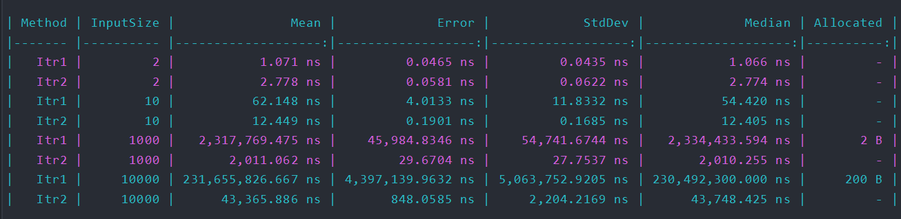

|      	| Time   	| Space 	|
|------	|--------	|-------	|
| ITR1 	| O(n^2) 	| O(1)  	|
| ITR2 	| O(n)   	| O(1)  	|

Solution (Spoiler Alert):
```c#
 public static int MaxProductMultipleOfThree(int[] numbers)
    {
        if (numbers.Length <= 1)
        {
            return int.MinValue;
        }

        var biggestMultipleOf3 = int.MinValue;
        var max = int.MinValue;

        foreach (var t in numbers)
        {
            if (t % 3 == 0 && t > biggestMultipleOf3)
            {
                biggestMultipleOf3 = t;
            }
            else if (t > max)
            {
                max = t;
            }
        }

        return biggestMultipleOf3 * max;
    }
```